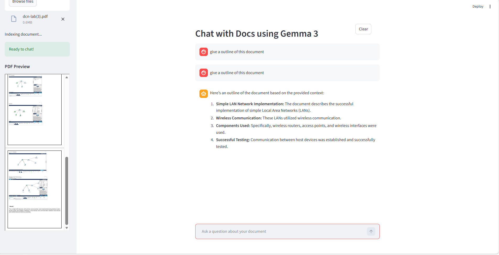

# Document Chat RAG

An AI application that allows users to upload PDF documents and chat with them using Retrieval-Augmented Generation (RAG).

---

## Features

* Upload PDF documents
* Convert document text into embeddings
* Retrieve relevant document chunks
* Generate answers using a local LLM
* Interactive chat interface with Streamlit
* PDF preview inside the app

---

## Tech Stack

* Python
* Streamlit
* LlamaIndex
* Ollama
* HuggingFace Embeddings
* Gemma 3 (Local LLM)

---

## Project Structure

```
document-chat-rag
│
├── app.py
├── requirements.txt
├── README.md
└── assets
    └── demo.png
```

---

## Installation

### Install dependencies

```
pip install -r requirements.txt
```

### Install Ollama

Download and install from:

```
https://ollama.com
```

### Pull the model

```
ollama pull gemma3:4b
```

---

## Run the Application

```
python -m streamlit run app.py
```

Open the application in your browser:

```
http://localhost:8501
```

---

## Demo




## Example Questions

* Summarize this document
* What is the main topic of the document?
* List key points from the document

---

## License

This project is for educational and demonstration purposes.
